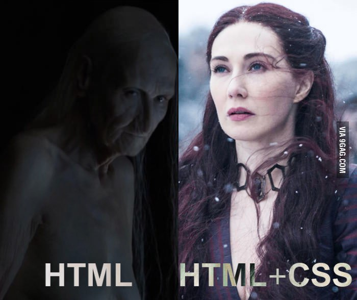

# Украшаем страницу

1. Что такое CSS
2. Стили по умолчанию в браузере.
3. CSS-правило: селектор, свойства, значения.
4. Классы в разметке и стилях.
5. Составные селекторы: правила чтения, "вес" селекторов.
6. Работа в CSS внутри Тильды.

> Интерактив + дз: Дополняем страницу проекта контентом (по возможности), создаем разметку нулевого блока, используя классы.

## Что такое CSS

CSS – это язык программирования, с помощью которого вы можете сделать свой сайт уникальным. Если HTML это скелет сайта, то CSS – это его уникальный внешний вид.



В отличии от HTML, который является языком разметки, CSS уже вполне себе язык программирования. Две эти технологии неразрывно связаны.

CSS появился в 17 декабря 1996, почти 3 года спустя после появления HTML (1993). И долгое время к нему не относились всерьез. Даже если что-то нужно было изменить на текстовых страницах, то стили писали прямо внутри html-разметки при помощи атрибутов.

В определенный момент развития интернета разработчики CSS оценили. Поняли, что можно создать разметку один раз, а при помощи CSS придавать ей разный вид сколько угодно.

Но вернемся немного назад и посмотрим, как существовали веб-сайты без стилей.
Стили по умолчанию в браузере
Давайте снова посмотрим на первую в мире веб-страницу

[Первая в мире веб-страница](http://info.cern.ch/hypertext/WWW/TheProject.html)

Даже при учете того, что css-стилей на тот момент вообще не существовало, мы с вами сразу можем определить заголовок страницы, увидим ссылки. Но как же так, если к странице не применялись никакие стили? Все браузеры имеют набор встроенных стилей. Таким образом, даже простая html-страница будет выглядеть приемлемо. Пользователь сможет понять, где находится заголовок, подзаголовок, абзац текста.
Бывают случаи, когда стандартных стилей вполне достаточно. Но это случается редко. Как же придать нашей странице красоту и уникальность?

CSS-правило: селектор, свойства, значения
Для начала давайте взглянем на кусок CSS-кода:
```css
h1 {
  color: red;
}
```

Предположите, из чего состоит этот код?

Что означает `h1`?
Что такое `color: red`?

Все верно, при помощи h1 мы обращаемся к заголовку первого уровня на нашей странице. Эта часть называется селектором.
color: red делает цвет текста красным. color  в данном случае называется свойством, а red – значением свойства.
Вся конструкция целиком называется правилом. Обратите внимание, что все свойства должны находится внутри фигурных скобок, а после значений всегда стоит точка с запятой. Это очень важно, иначе ничего не сработает.

Отлично, мы теперь знаем как изменить цвет текста. Давайте вместе напишем правило, которое изменит цвет текста абзацев текста на `#BADA55`.
```css
p {
  color: #BADA55;
}
```

Супер! Теперь мы умеем менять цвет текста.

Давайте попробуем другой пример.

```html
<p>Я красный текст</p>
<p>Я зеленый цвет</p>
```

Если мы напишем такое же правило, как в прошлый раз, то оба абзаца будут одного цвета. Есть предположения, как можно задать разный цвет?

Нам помогут классы!
Классы в разметке и стилях
Классы созданы для того, чтобы применять разные стили к одинаковым тегам.

Класс задается следующим образом:
```html
<p class="red-text">Я красный текст</p>
<p class="green-text">Я зеленый цвет</p>
```

Имена классов могут быть любыми, но не могут начинаться с цифры и могут содержать только латинские буквы.
Поскольку английский язык является общепринятым среди программистов, то названия классов должны быть английскими словами. Не используйте транслит.

Напишем наконец стили для нашего разноцветного текста.
В CSS перед классом ставится точка.
Как будут выглядеть правила для наших абзацев?
```css
.red-text {
  color: red;
}

.green-text {
  color: green;
}
```

Помимо тегов и классов селекторы могут быть составные.

Немного усложним нашу разметку,
```html
<p class="red-text">Я <span>красный</span> текст</p>
<p class="green-text">Я <span>зеленый</span> цвет</p>
```

Давайте сделаем так, чтобы цвет текста менялся у слов «красный» и «зеленый».
Мы можем написать правило
```css
span {
  color: red;
}
```

Но тогда снова возникнет проблема, что оба слова раскрашены одним цветом.
Давайте попробуем указать стилям, что они должны применяться только к span, вложенным в абзац с классом `red-text`.

Есть предположения?
```css
.red-text span {
  color: red;
}

.green-text span {
  color: green;
}
```

Мы можем комбинировать любые классы и тексты так, чтобы «добраться» до нужного элемента.
