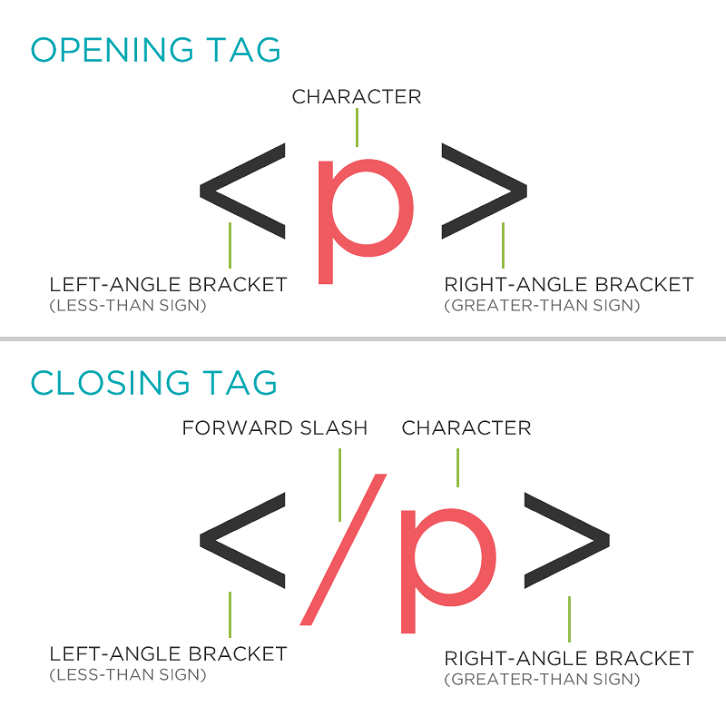

# Структура документа

1. Понятие семантики на примере книг и другой печатной продукции.
2. Понятие тега в HTML.
3. Роль тега в HTML. (пример http://CSS.yoksel.ru/specifity/)
4. Разбивка готового макета на логические блоки и подбор семантических тегов. *
5. Типографика: абзац, заголовок, ссылка, список.
6. Ссылки – основа интернета.
7. Стили по умолчанию на примере ссылки.

> Интерактив + дз: Собрать в Тильде основную структуру страницы проекта на основе мокапа от дизайнерской группы. Предусмотреть минимум один нулевой блок.

## Понятие семантики на примере книг и другой печатной продукции
Разобраться в том, что такое семантика, нам помогут несколько примеров.

### Заголовки

- С момента появления рукописи люди старались визуально выделить название текста. Так появился заголовок


- Эта традиция сохранилась и с появлением печатных книг


- И сохранилась до текущего времени


### Заголовки разных уровней

Для того, чтобы текст был логически упорядоченным не всегда достаточно одного заголовка.
- Например, для разделения текста на главы.


- Для дополнения основного заголовка (подзаголовок) или разделения уровней значимости новостей.
На этой газетной странице видно сразу пять уровней заголовков.


- В одном тексте можно (и нужно) комбинировать несколько уровней заголовков, если того требует смысл.


### Абзацы
Разделение текста на абзацы для простоты чтения и восприятия так же существовало всегда.

- В книжных текстах для разделения текста на абзацы текст писали с новой строки, а первую букву делали большой, красочной и украшали ее вензелями.


- После появления печатных книг этот прием сохранялся еще какое-то время


- Но теперь для абзацев используется красная строка и отступ от левого края страницы. Кстати, этот отступ – все, что осталось от большой и красочной первой буквы.


- На сайтах также используется разделение на абзацы. Тепографические принципы применимы и здесь.


### Цитата
Цитаты нужны для вставки в текст части другого текста или прямой речи человека.

- Цитаты часто используются в печатных книгах


- Сайты во многом переняли традиции печатного текста, поскольку они привычны всем людям и просты для восприятия. На сайтах цитаты принято оформлять карсочно и ярко.


### Маркированный список
- Списки часто используются как в обычной жизни


- так и в печатной литературе, на сайтах


- Список ложится в основу популярных todo-сервисов


### Нумерованный список

Если в списке важен порядок дейтсвий, то применяется нумерованный список.


### Иллюстрации

- Иллюстрации в тексте оживляют историю


- Или наглядно отражают описанные данные


- «Страна должна знать своих героев!»


- Часто под фотографией или изображением идет подпись, поясняющяя, что именно изображено.


- Иногда картинка и текст тесно перелетаются и одно без другого будет неполноценным


## Семантическая разметка

Все или по крайней мере большую часть из этого вы делали самостоятельно. Например, в программе MS Word при написании рефератов, диплома или рабочих текстов.


Есть вариант выделять заголовки просто более крупным размером шрифта или жирным начертанием

- Задавайте заголовки при помощи специальных стилей


Это даст вам возможность быстро составить оглавление, буквально в два клика.


- Если вы просто выделите текст при помощи более крупного размера шрифта и/или жирного начертания, то оглавление придется составлять вручную, что займет гораздо больше времени, чем при правильном оформлении текста.


## Разметка в браузере
Правильно определять разметку текста нам помогает накопленный опыт (много книг прочитано, обучение в школе и т.д.).
Но у браузера нет подобного опыта.
Браузер видит неразмеченный текст и выводит его на страницу следующим образом:


Если мы «отдадим» браузеру документ, в котором правильно будут отмечены заголовки, абзацы, списки, картинки, то он без проблем отобразит страницу именно так, как нам нужно.

Осталось понять, как, при помощи каких инструментов мы можем указать браузеру где какой элемент находится.

## Понятие тега в HTML
Для разметки текста и других элементов используются специальные метки, которые обозначают начало и конец абзаца, заголовка и все остальные элементы. Чаще всего их называют тегами. Набор тегов ограничен, и у каждого из них своя роль.



Теги в HTML заключены в угловые скобки < >
Нам привычнее их называть символами меньше и больше. Так как нам нужно обозначать начало и конец элемента, например абзаца, то существует понятие открывающего и закрывающего тега.
Тег `p` — позволяет выделить абзац текста (Paragraph по английски).

Для всех элементов, которые мы видели выше на картинке есть свои теги:
– Параграфы `p`
– Заголовки `h1`-`h6`
– Цитаты `blockquote`
– Картинки `img`.

```HTML
<p>Абзац текста.</p>
```

Для разметки заголовков предусмотрено 6 тегов, что позволяет нам различать заголовки разного уровня `h1-h6` (Heading)

```HTML
<h1>Заголовок первого уровня</h1>
<h2>Заголовок второго уровня</h2>
<h6>Заголовок шестого уровня</h6>
```

Для разметки блоков цитат, врезок и просто выделенных блоков текста предусмотрен тег `blockquote`.

```HTML
<blockquote>
  Цитата великого целовека!
</blockquote>
```

Если не закрыть один из тегов, это может привести к ошибке отображения.

Для вставки картинки на страницу используется *одиночный* тег `img`. Одиночный он потому, что его не нужно закрывать.
В открывающемся теге указывается атрибут `src` с адресом, по которому браузер может найти картинку.

```HTML

```

## Разбиваем макет на элементы
>Самостоятельная работа с помощью преподавателя.
Дать понятия секции, шапки и футера, статьи и боковой колонки.

## Ссылки. Стандартные стили
В вебе есть то, чего нет в типографике. Соответственно мы с вами еще не рассмотрели этот тег. С самого начала интернета единственным доступным интерактивом были ссылки, позволяющие переходить между страницами. Логично, что в печатных книгах или газетах, такого быть не может.

Для ссылок используется тег `a`. Давайте добавим его на нашу страницу. Удивительно, но ссылки стали синего цвета и подчеркнутыми, хотя весь остальной текст на нашей странице черный.
На этом примере мы можем видеть, что у любого тега есть те или иные стили по умолчанию. Браузер, даже если вы не напишите собственных стилей, отобразит элемент со стандартными стилями. Отсюда разный размер шрифтов заголовков, цифры у нумерованных списков и отступы у цитат. Так и цвет ссылок.
Поэтому даже если вы напишите HTML-разметку без каких-либо стилей ваша страница будет вполне читабельной. По вашему желанию вы в любой момент сможете переопределить стандартные стили в момент, когда будете писать CSS.
