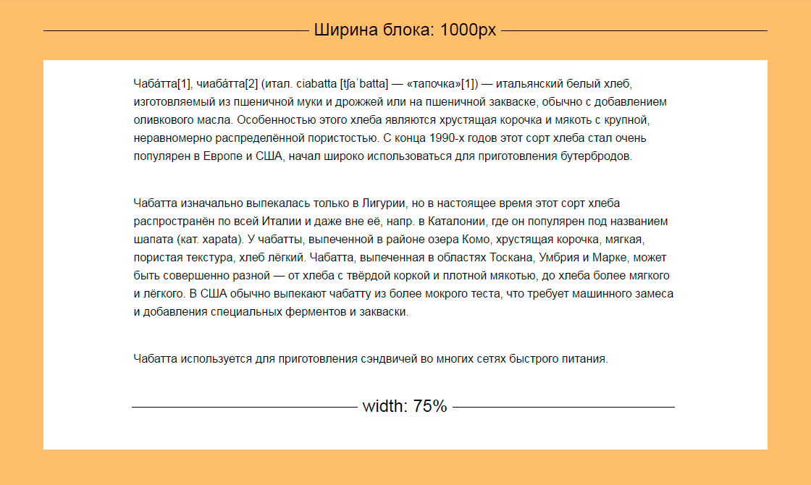

# Свойства стилей
1. Свойства для работы с текстом:
 - font-size;
 - color;
 - font-family;
 - text-align;
2. Фоны. Учимся заливать фон. Устанавливаем картинку на фон. Повторяем или растягиваем картинку.
3. Блочная модель.
4. margin и padding: отступы по всем сторонам и для каждой из сторон отдельно. Шорткат и порядок записи значений.
5. width и height на примере работы с картинками (или текстом).
 
> Интерактив + дз: Дополняем страницу стилями, кастомизируем фоны, шрифты, размеры блоков. Добавляем стили для нулевого блока (сделать упор)
 
## Свойства для работы с текстом
Самая главная составляющая любой веб-страницы это текст. Именно информация, правильно организованная в пространстве, с удачно расставленными акцентами и есть настоящий дизайн, а не градиенты и гифки, как вы могли подумать. При помощи одного только текста в середине 20 века создавали образы, которые многие ценят до сих пор.
 
Пример — швейцарская типографика.
 

 
Поэтому первым делом давайте научимся управлять отображением текста на веб-страницах.
 
### Цвет
Изменить цвет шрифта и его декоративных элементов (например, подчеркивания), можно при помощи свойства color.
 ``` color: <цвет> | transparent
 ```
 
Проще всего установить прозрачный цвет, если уж вам это для чего-то нужно. Так и напишите: прозрачный (transparent)
```
.ghost {
  color: transparent;
}
```
 
#### Цвет по названию
 
Также цвет можно задать по названию. В вебе допускается использовать 16 значений цветов: aqua (аквамарин), black (черный), blue (синий), fuchsia (фуксиновый), gray (серый), green (зеленый), lime (лайм или салатовый), maroon (каштановый), navy (ультрамарин), olive (оливковый), purple (пурпурный), red (красный), silver (серебристый), teal (сизый), white (белый) и yellow (желтый).
 
Пример:
```
.widow {
  background-color: black;
}
```
  
#### С помощью RGB
Чаще всего для определения цвета используется формат RGB, название которого происходит от слов «красный», «зеленый», «синий».   
 
Код цвета можно подсмотреть в графическом редакторе, например в Photoshop:

  

> Лайфак: в ситуации «шестадцатиричный код или жизнь» называйте #bebebe или #dadada
 
Пример:
```
.grey {
  color: #dadada;
}
```
 
### Размер шрифта
Инструмент первой необходимости это возможность изменить размер шрифта. Управлять размером позволяет свойство font-size. По умолчанию (если не заданы никакие правила) размер шрифта на веб-странице будет равен 16px.
 ``` font-size: <абсолютный размер> | <относительный размер> | <размер> | <проценты>
 ```
Поскольку весь измеряется чаще всего в пикселах, то и размер шрифта проще всего установить в пикселях.
 
Пример:
```p {
  font-size: 24px;
}
 ```
Вы можете задать размер текста и при помощи сантиметров или типографских пунктов, но предугадать результат будет гораздо сложнее.
 
Также размер может быть задан в процентах. За 100% берется размер шрифта родительского элемента. Хотите увеличить размер в полтора раза? Задайте 150%.
 
Пример:
```p {
  font-size: 150%;
}
 ```
Существует удобный набор констант (larger, smaller), который устанавливает относительные размеры шрифта. Этот метод очень удобен, если, например, вы не видите стилей, применяющихся к странице, но твёрдо знаете, что вам нужно сделать заголовок большим, чем основной текст.
 
Пример:
```h1 {
  font-size: larger;
}
 ```
 
### Семейство шрифта
Для того, чтобы установить семейство шрифта, которое будет использоваться для оформления текстового содержимого, используется свойство font-family. Забудьте про атрибут font, он безнадёжно устарел. Список шрифтов может включать одно или несколько названий, разделённых запятой. 
 
```font-family: <шрифт> [, <шрифт>[, ...]]
```
Когда браузер встречает первый шрифт в списке, он проверяет его наличие на компьютере пользователя. Если такого шрифта нет, берётся следующее имя из списка и также анализируется на присутствие. Поэтому несколько шрифтов увеличивает вероятность, что хотя бы один из них будет обнаружен на компьютере вашего пользователя и он не увидит нечто такое:
 
  
  
Заканчивают список обычно ключевым словом, которое описывает тип шрифта — serif, sans-serif, cursive, fantasy или monospace. Таким образом, последовательность шрифтов лучше начинать с экзотических типов и заканчивать обобщённым именем, которое задаёт вид начертания. Если в имени шрифта содержатся пробелы, например, Trebuchet MS, оно должно заключаться в одинарные или двойные кавычки.
 
Пример:
```p {
  font-family: Georgia, 'Times New Roman', Times, serif;
  }
  ```
 
### Выравнивание текста
Свойство text-align используется для того, чтобы выровнять текст по левому краю, по правому, по центру или по ширине. 
```text-align: center | justify | left | right | start | end
```
Значения left, center, right говорят сами за себя. Justify — выравнивание по ширине. С его помощью можно получить ровные графичные колонки, как в газетах. В web, однако, выравнивание по ширине практически не используется.
 
  
 
Значение start аналогично значению left, если текст идёт слева направо и right, когда текст идёт справа налево.
 
Зачение end аналогично значению right, если текст идёт слева направо и left, когда текст идёт справа налево.
 
 
## Фоны. Учимся заливать фон. Устанавливаем картинку на фон. Повторяем или растягиваем картинку.
### Заливка фона
Для настройки цвета фона используется свойство background-color.
 
Синтаксис:
background-color: <цвет> | transparent
 
Свойство background-color принимает в качестве значений те же обозначения цветов, что и свойство color: шестнадцатеричное значение, название на английском языке, форматы RGB, RGBA, HSL, HSLA.
 
### Фон картинкой
На фон можно установить одну или несколько картинок в различных форматах изображений.
 
Синтаксис:
```background-image: url(<path>);
 ```
Если одновременно для элемента задан цвет фона, он будет показан, пока фоновая картинка не загрузится полностью. То же произойдет, если изображения не доступны или их показ в браузере отключен. В случае наличия в рисунке прозрачных областей, через них будет проглядывать фоновый цвет. Допустимо указывать несколько фоновых изображений, перечисляя их параметры через запятую.
 
Пример:
```background-image: url(/example/image/bg.jpg);
background-color: #c7b39b;
 ```
 
### Расположение фона
Положение фонового изображения, установленного с помощью свойства background-image, можно изменить при помощи background-position. 
 
У свойства background-position два значения, положение по горизонтали (может быть — left, center, right) и вертикали (может быть — top, center, bottom). Кроме использования ключевых слов положение также можно задавать в процентах, пикселях или других единицах. Если применяются ключевые слова, то порядок их следования не имеет значения, при процентной записи вначале задаётся положение рисунка по горизонтали, а затем, через пробел, положение по вертикали. Отношение между используемыми ключевыми словами и процентной записью следующее.
 
Примеры:
```background-position: top left; /* в левом верхнем углу */
background-position: 50% 100%; /* по центру внизу */
 ```
 
### Повтор фона
Если изображение имеет меньший размер, чем блок, для которого требуется настроить фон, то можно задать повтор блока при помощи свойства background-repeat.
 
Можно установить повторение рисунка только по горизонтали (repeat-x), по вертикали (repeat-y), в обе стороны (repeat) или отключить повтор (no-repeat). Допустимо указывать несколько значений для каждого фона, перечисляя значения через запятую.
 
Примеры:
```background-repeat: no-repeat;
background-repeat: repeat-x; 
background-repeat: repeat-y; 
background-repeat: repeat; 
```
 
### Shorthand-свойство
Данное свойство позволяет установить все характеристики фона, которые мы рассмотрели, в одном правиле. Значения могут идти в любом порядке, браузер сам определит, какое из них соответствует нужному свойству. 
 
Синтасис:
```background:  <color> <image> <repeat> <position>; 
 ```
Например, три следующих свойства, последовательно указывающих адрес изображения, его положение и повтор по горизонтали —
```background-image: url(/example/image/bg_grey.png);
background-position: left bottom;
background-repeat: repeat-x;
 ```
 
— можно записать в одно правило вот так:
```background: url(/example/image/bg_grey.png) left bottom repeat-x;
```

Также shorthand-свойство может содержать не все значения, а только их часть, например:
```background: url(a.jpg) no-repeat center; 
background: #ccc; 
```
 
## Блочная модель
Блочная модель описывает, из чего состоит блок и какие свойства влияют на его размеры. То есть, стандартная блочная модель даёт ответ на основной вопрос: сколько же в итоге места будет занимать элемент?
 
Ответ такой: область, которую в итоге занимает блочный элемент, состоит из ширины и высоты его содержимого, из внутренних и внешних отступов, плюс ширина рамок.
 
  
 
Ширина и высота содержимого управляется напрямую свойствами width и height.
 
Рамки устанавливаются свойством border.
 
Внутренние отступы (поля) это padding. Внешние отступы задаются свойством margin.
 
 
## Margin и padding: отступы по всем сторонам и для каждой из сторон отдельно
 
Свойство padding задает внутренние отступы элемента — отступы от внешней границы элемента до его содержания. Эти отступы еще иногда называют полями.
 
Свойство margin задает внешние отступы элемента — отступы от внешней границы элемента до границ родительского элемента или до соседних элементов.
 
  
 
Синтаксис:
```margin: [<размер> | <проценты> | auto] {1,4 значения}
```
Разрешается использовать одно, два, три или четыре значения, разделяя их между собой пробелом. Эффект зависит от количества значений.
 
1 значение:
```margin: 20px;```
Добавит отступ по всем сторонам, равный 20 пикселям. 
 
  
 
2 значения:
```margin: 10px 100px;```
Первое значение устанавливает отступ от верхнего и нижнего края, второе — от левого и правого.
 
  
 
3 значения:
```margin: 5px 100px 40px;```
Первое значение задает отступ от верхнего края, второе — одновременно от левого и правого края, а третье — от нижнего края.
 
  
 
4 значения:
```margin: 3px 30px 60px 90px;```
Поочередно устанавливается отступ от верхнего, правого, нижнего и левого края.
 
  
 
Величину отступов можно указывать в пикселях (px), процентах (%) или других допустимых для CSS единицах. Значение может быть как положительным, так и отрицательным числом.
 
Значение свойства auto указывает, что размер отступов будет автоматически рассчитан браузером.
 
Фактически свойства margin и padding можно назвать shorthand-свойствами, так как они объединяют в себе свойства, использующиеся для указания отступов с каждой из сторон. Свойства margin-top, margin-left, margin-right, margin-bottom устанавливают отступы, соответственно, сверху, слева, справа и снизу. Аналогично можно указывать по-отдельности размеры полей при помощи свойств padding-top, padding-left, padding-right, padding-bottom.
 
  

Может быть перечислено любое количество свойств, например, только одно:
 
```p {
  margin-left: 20px;
}
 ```
Отступ с других сторон будет рассчитан по умолчанию.
 
 
## Width и height на примере работы с картинками (или текстом)
Зачем управлять размером? Чтобы сделать нечитаемое привлекательным, расставить акценты, организовать информацию в пространстве:
 
  
 
С помощью свойств width и height можно задавать соответственно ширину и высоту элементов на странице.
 
Синтаксис:
```width: <размер> | <проценты> | auto
height: <размер> | <проценты> | auto
 ```
По умолчанию, когда размеры элемента никак не заданы, они управляются веб-браузером. Свойства height и width имеют значение auto. В этом случае размеры элемента будут такие, чтобы в нем полностью поместилось все его содержимое. Текст будет стремиться занять всё доступное пространство по ширине, изображение примет такие размеры, в каких было загружено.
 
 
 
Ширина и высота может быть задана при помощи любых доступных в CSS единиц измерения — например, в пикселях (px), дюймах (in), пунктах (pt) и др.
 
Например, width: 500px:
 
 
 
Кроме абсолютных единиц можно задавать относительное размеры элементов в процентах. В этом случае ширина и высота элемента будет зависеть от ширины и высоты родительского элемента. Если родитель явно не указан, то размеры будут зависеть от окна браузера:
 
Например: width: 75%; Ширина параграфов текста рассчитывается от ширины белого блока.
 
 
 
 > Интерактив + дз: Дополняем страницу стилями, кастомизируем фоны, шрифты, размеры блоков. Добавляем стили для нулевого блока (сделать упор)